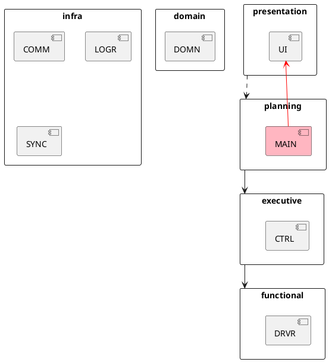

# Architecture

## Layers

### Infra
Foundational infrastructure/libraries that any other component may be built
on top of. These are agnostic of the `linebot` domain.
- \subpage COMM_page
- \subpage LOGR_page
- \subpage SYNC_page

### Domain
Definitions of the basic concepts common to multiple layers.
This layer (similarly to **Infra**) is orthogonal to the others;
meaning that any/each of the following layers may depend on it.
- \subpage DOMN_page

### Functional
The simulation, and eventually hardware drivers; this layer deals directly
with actuation and sensing.
- \subpage DRVR_page

### Executive
This layer monitors and commands **Functional** to perform meaningful
short-term actions.
- \subpage CTRL_page

### Planning
This layer orchestrates sequences of **Executive** actions.
- \subpage MAIN_page

### Presentation
The external interface of the entire system.
- \subpage UI_page


## Layer Hierarchy



## Sequence Diagram

```plantuml
participant MAIN
participant CTRL
participant UI
participant DRVR

MAIN -> DRVR: initialize()
MAIN -> UI: initialize(IDriver)
MAIN -> CTRL: initialize(IDriver)

loop
  MAIN -> UI++: read_move()
  return move

  MAIN -> CTRL++: execute_move(move)
    CTRL -> CTRL: //calculate//
    CTRL -> DRVR: accelerate()
    ...
  return
end loop
```
