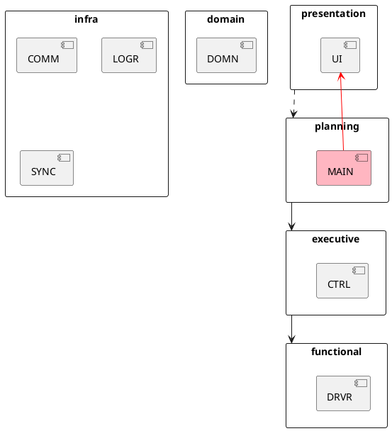

# Architecture

## Layers



## Sequence Diagram

```plantuml
participant MAIN
participant CTRL
participant UI
participant DRVR

MAIN -> DRVR: initialize()
MAIN -> UI: initialize(IDriver)
MAIN -> CTRL: initialize(IDriver)

loop
  MAIN -> UI++: read_move()
  return move

  MAIN -> CTRL++: execute_move(move)
    CTRL -> CTRL: //calculate//
    CTRL -> DRVR: accelerate()
    ...
  return
end loop
```
